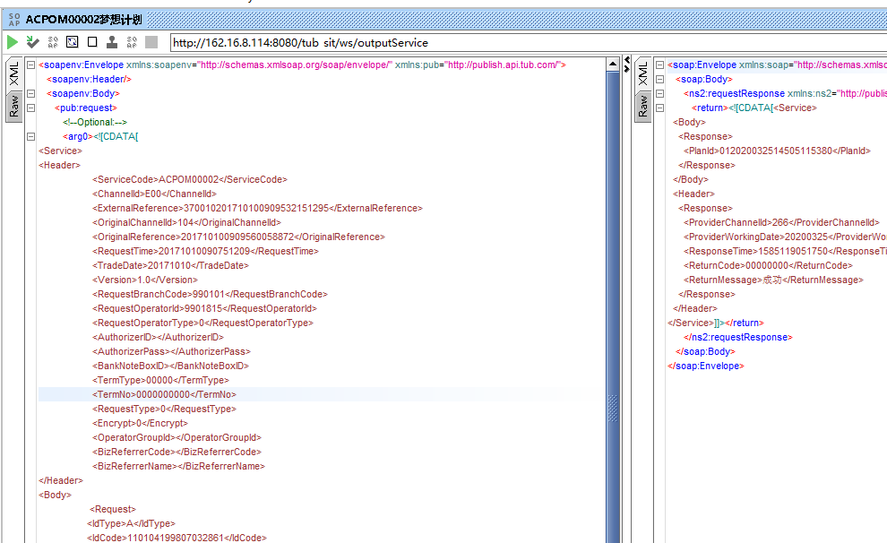
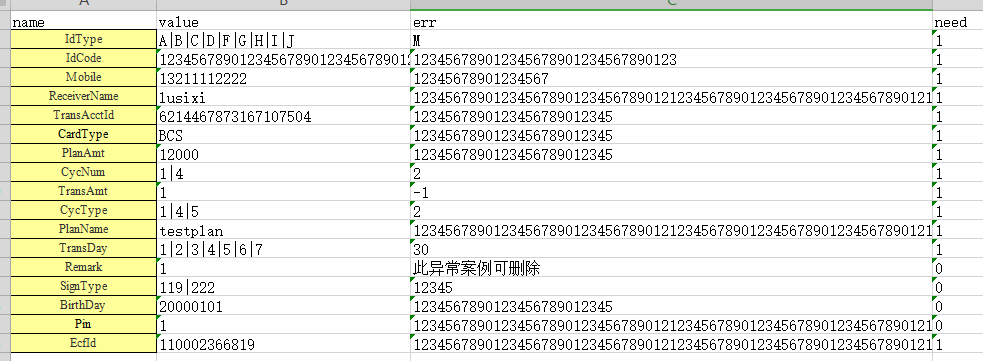
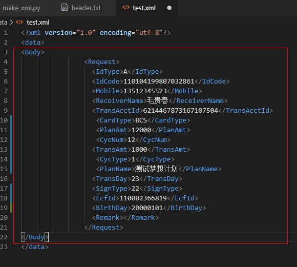
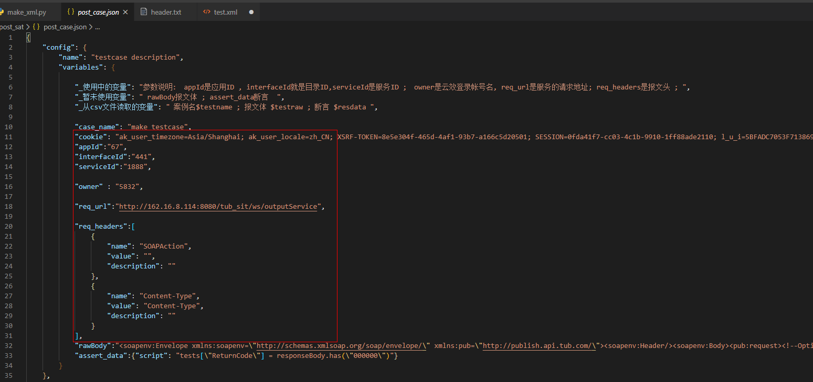
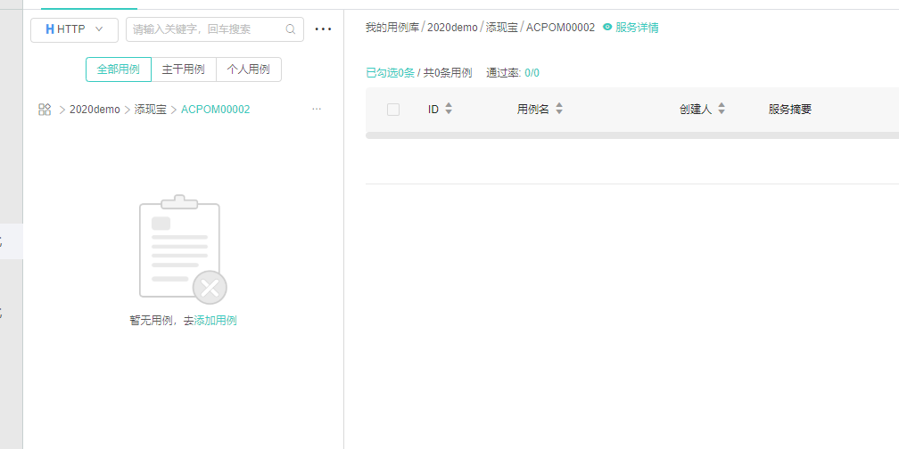
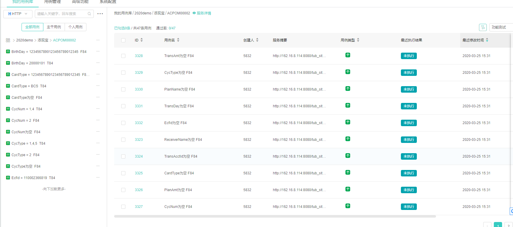

### 脚本下载

git下载工程 `git clone http://gitlab.scott.oracle.com/5832/sat_script`


### 数据准备

1. 准备一个能通过的报文

2. 手工生成基础案例,放入`./data/testcase.xlsx`  value是正确值,err是错误值,need为1代表必填!,用|分割每个可能的值.

   

3. 提取Body之前的文件,放入 `./data/header.txt`

4. 提取Body字段,放入`./data/test.xml` , 红框处

5. 修改`./post_sat/post_case.json`文件里红框处几个字段

6. 运行make_xml.py: `python .\make_xml.py`

7. 进入`post_sat`目录,运行tests.json:　` hrun test.json`

8. 运行前:

9. 运行后:


### 备注

1. 这里所有的断言都是在`make_xml.py`里定义:

   ```
   # 参数分别为 当前案例标题, 当前案例xml报文Body内容, 文件名
   def res_xml(title , iitem, filename):
   
       ret_data = ''
   
       # 设置接口的断言判断语句
       if filename == 'trueFile':
           ret_data = "tests[\"ReturnCode\"] = responseBody.has(\"000000\")"     
       else:
           ret_data = "tests[\"ReturnCode\"] = responseBody.has(\"FUS27777\")"
   
   ```

   因此需要对自己接口做修改.  

   后面也会迭代作为一个配置项.

2. 建议先在2020Demo目录里自己新建个服务,测试应用是否能正常生成案例,因为可能会有各种问题需要调试.调试通过,可以正确生成案例了, 再去正式的应用下建立案例.  

   对应配置项为`post_case.json`文件的`appId`,`interfaceId`,`serviceId` , appId是应用ID , interfaceId就是目录ID,serviceId是服务ID.